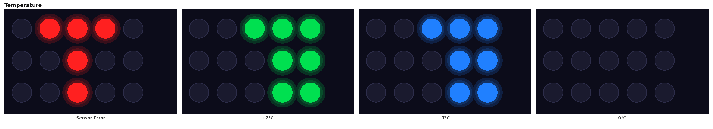
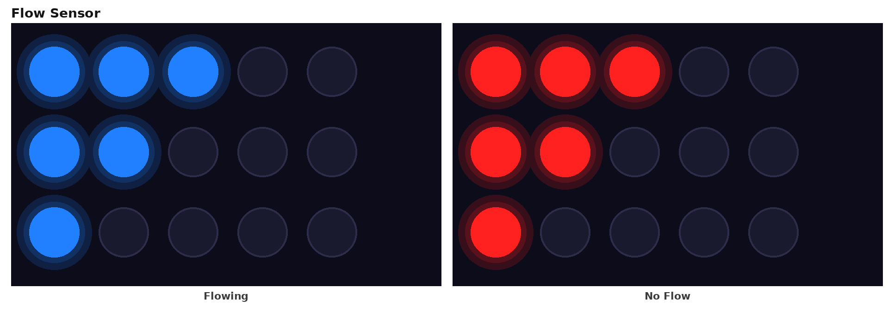
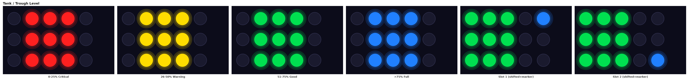
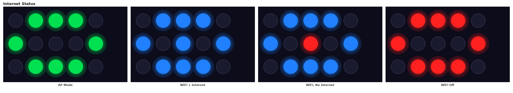
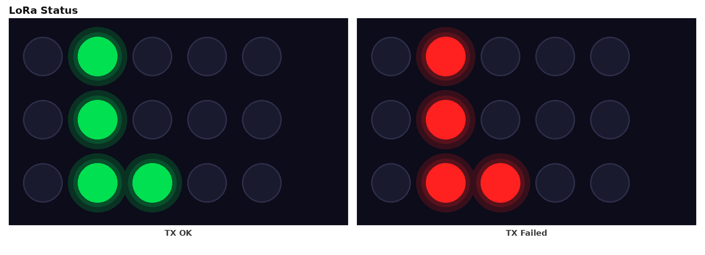
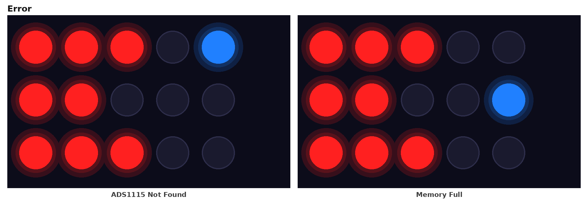
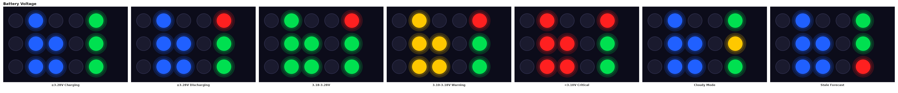

# Daffodil Manual

*Complete reference: configuration switch, per-device calibration, power management, and LED
status display. Supersedes "Daffodil Power Management and Configuration.md". Last updated
2026-09-03.*

---

## Table of Contents

1. [Overview](#1-overview)
2. [Configuration Switch — Function Modes](#2-configuration-switch--function-modes)
3. [Per-Device CSW Calibration](#3-per-device-csw-calibration)
4. [Power Management](#4-power-management)
5. [LED Status Display Guide](#5-led-status-display-guide)
6. [Serial Command Reference](#6-serial-command-reference)
7. [Troubleshooting](#7-troubleshooting)
8. [Known Limitations / Roadmap](#8-known-limitations--roadmap)

---

## 1. Overview

Daffodil is a solar/battery-powered field sensor unit built around an ESP32 (FireBeetle32) main
board ("Wally") with a sensor interface shield ("Daffodil") stacked on top. It monitors water
troughs, septic tanks, flow meters, and tank levels, reporting over WiFi to the Digital Stables
cloud, and over LoRa (433MHz) to other units on site (e.g. Annabelle for weather forecast
relay, or a LoRa base station like Paula).

Configuration is entirely physical: a **5-position DIP switch** (the "config switch" or CSW),
read at power-on as an analog voltage through a resistor ladder into the ADS1115 ADC.

- **Switches 1–4** select the device's **function** — what it measures and reports.
- **Switch 5** selects the device's **reporting mode** — see §2.2. It does not change the
  function.

No other configuration is required to get a unit reporting once WiFi/LoRa credentials are set —
but a **one-time per-device calibration** (§3) is required for the switch itself to decode
reliably, and is easy to overlook on a hand-flashed unit (the Factory tool does it
automatically — see §3.2).

## 2. Configuration Switch — Function Modes

### 2.1 Function table (switches 1–4)

| Switches 1–4 | Function | Status |
|---|---|---|
| `0000` | 1 Flow Sensor | Available |
| `1000` | 2 Flow Sensors | Available |
| `0100` | 1 Flow Sensor + 1 Tank | Available |
| `1100` | 1 Tank | Available |
| `0010` | 2 Tanks | Available |
| `1010` | Septic Tank | Available |
| `0110` | Water Trough | Available |
| `1110` | Water Trough + Tank | Available |
| `0011` | 2 Water Troughs | **Coming soon** — sensor hardware not yet shipped |
| all other combinations | — | Reserved / not yet in use |

Firmware-internal names, for reference when reading debug output or this document's other
sections: `FUN_1_FLOW`, `FUN_2_FLOW`, `FUN_1_FLOW_1_TANK`, `FUN_1_TANK`, `FUN_2_TANK`,
`DAFFODIL_SCEPTIC_TANK`, `DAFFODIL_WATER_TROUGH`, `DAFFODIL_WATER_TROUGH_TANK1`,
`DAFFODIL_2_WATER_TROUGH`.

**Screw terminal wiring**, for the flow/tank sensor slots referenced throughout this manual:

| Terminal | GPIO | Used for |
|---|---|---|
| Sensor 1 | pin 18 | Flow meter 1 (interrupt pulse count), or Tank 1 pressure (jumpered to ADS1115) |
| Sensor 2 | pin 33 | Flow meter 2 (interrupt pulse count), or Tank 2 pressure (jumpered to ADS1115) |

`2 Water Troughs` (`0011`) has its switch position and firmware constant assigned, but sensor-
reading and LED-display code isn't implemented yet — pending the UART ultrasonic sensor
hardware.

### 2.2 Switch 5 — Reporting Mode

Switch 5 is **not** "solar attached or not." It's a trade-off between **how often the unit
checks in** and **how long the battery lasts**:

- **ON — Battery Saver.** The unit paces itself against its solar-charging schedule: it sleeps
  more and reports less often, trading frequency for battery life. Right setting for most
  unattended, solar-charged deployments (e.g. a trough level sensor) that don't need
  minute-by-minute updates.
- **OFF — Frequent Reports.** The unit reports more often and doesn't wait on the solar
  schedule, giving closer-to-real-time readings (e.g. active flow monitoring). Uses more
  battery — best when the unit has reliable charging, or you're accepting shorter battery life
  for more frequent data.

Either way, the unit still protects its battery from over-discharging (§4.3) — the difference
is purely about reporting frequency, not battery safety.

## 3. Per-Device CSW Calibration

### 3.1 Why this is necessary

The switch ladder's pull-up resistor is fed by `DEVICE_POWER` (the `V50` rail through a load
switch) — not the panel/USB input voltage the firmware measures on another ADC channel. On
battery power, `V50` comes from a boost converter fed by the battery, and its exact level varies
from unit to unit (confirmed empirically: two different battery units showed a consistent ~13%
difference in raw switch readings across every position). Since the ADS1115 measures an absolute
voltage, every raw switch reading scales with whatever `V50` actually is on that specific unit.

There's no spare ADC channel to measure `V50` directly, so the fix is a one-time **per-device
scale calibration** stored in flash, rather than one fixed threshold table for every unit.

### 3.2 Calibration procedure

Run this once per device at install time, and again any time the battery is swapped for a
substantially different one:

1. Set the DIP switches to `00000` (all off, no solar). **Double-check the switches physically
   before proceeding** — arming the calibration at the wrong position captures the wrong
   reference and silently corrupts the whole table. This is the single most common way to get
   this step wrong.
2. Power on / reset and let the device boot normally.
3. Send the serial command `CalibrateCSWReference`. This does **not** read the switch itself —
   it only arms a flag in flash. Sending it any time after the device has finished booting is
   fine; it doesn't need to be timed precisely, since the flag just waits in flash until the
   next reset.
4. **Reset the device again** (switches still at `00000`). This boot is the one that actually
   captures the reference reading, at the exact point in boot where the real switch decode
   happens (before WiFi/LoRa start) — reading it mid-runtime instead would see a different
   electrical load and give a wrong reference value.
5. **Verify with `printCSWData`.** Confirm `cswReferenceRaw` is a plausible `00000` reading
   (roughly 7000–8500 on units tested so far) — not `0` (never calibrated), and not matching
   some other switch position's raw value (a sign the switches moved before step 4). This
   command also prints `cswScaleFactor` and the resulting `cswDecodeValue`, so you can confirm
   the math end to end before trusting the unit.
6. Set the switches to the real desired function and reset again for normal operation.

**Factory tool automation.** As of 2026-09-01, the Factory device-configuration tool runs this
procedure automatically as the last step after flashing product firmware — it prompts for the
two switch/reset actions, sends `CalibrateCSWReference`, and verifies `cswReferenceRaw` itself.
Units configured through the Factory tool get this for free; it only needs doing manually for
units flashed some other way (e.g. a bench unit reflashed directly from the Arduino IDE).

**A reflash does not normally erase this.** Calibration lives in NVS (flash), a separate
partition from the sketch code — a normal Arduino "upload sketch" leaves it untouched. It's
only wiped by a full chip erase (`esptool.py erase_flash`, or Arduino IDE's **Tools → Erase All
Flash Before Sketch Upload** set to *Enabled* instead of the default *Disabled*). If a unit
that was previously calibrated suddenly isn't, check that setting first before assuming
something else is wrong — and note a full erase also wipes device name, WiFi credentials, and
every other stored setting at the same time, so if those are gone too, that confirms it.

### 3.3 How the calibration is applied

```
scaleFactor    = 8326 / cswReferenceRaw   (8326 = the original reference calibration's 00000 point)
cswDecodeValue = rawCSWValue * scaleFactor
```

`cswDecodeValue` — not the raw ADC reading — is what gets compared against the threshold table.
If a device has never been calibrated (`cswReferenceRaw == 0`), `scaleFactor` defaults to `1.0`.
An uncalibrated unit will often still decode to a *plausible-looking* function (because the
brackets are contiguous), just the wrong one — typically landing one bracket away from the
correct switch position, which is why this can look like a flaky switch reading rather than a
missing calibration. `printCSWData` (§3.2 step 5) is the only reliable way to tell the two apart.

### 3.4 Verification example

Symptom: switches set to `10001` (2 Flow Sensors, Battery Saver on), but the unit reports
`FUN_1_TANK` instead. Running `printCSWData` shows `cswReferenceRaw=0` — never calibrated — so
`cswScaleFactor` defaulted to `1.0`, and the unscaled raw reading landed one threshold bracket
below where it should have. Running the calibration procedure (§3.2) and resetting with the
switches back at the real function resolved it immediately.

## 4. Power Management

### 4.1 Two independent concepts

Battery protection and solar-aware reporting are **not** the same setting, even though earlier
firmware conflated them:

- **`hasBattery`** — computed once at boot from the battery-presence heuristic — gates *all*
  over-discharge protection: forced sleep at low voltage, LED cutoff, WiFi cutoff, and the
  critical-voltage COMMA mode (§4.3). This applies **regardless of Switch 5** — any unit with a
  real battery attached is protected.
- **`usingSolarPower`** (Switch 5) — purely the reporting-frequency trade-off described in §2.2.
  A unit with Switch 5 OFF (frequent reporting) still gets full battery protection if a battery
  is actually attached.

### 4.2 LED brightness

LED brightness is a function of **actual available power**, for every unit with a battery,
regardless of Switch 5:

1. **Darkness** — if the light sensor reads genuine night/deep-shade, brightness is capped low
   (30/255).
2. **Battery current headroom** — if the unit is net *discharging* even accounting for the
   LEDs' own draw, brightness drops low (20/255). If net *charging*, brightness scales smoothly
   up toward full in proportion to how much charging headroom exists. This is a smoothed,
   one-cycle-delayed calculation rather than an instant on/off snap, specifically to avoid
   oscillating on and off right at the charge/discharge boundary.
3. **Low battery voltage** — hard floor at low brightness if battery voltage drops below 3.28V,
   regardless of the above.

### 4.3 Battery protection thresholds

| Threshold | Value | Effect |
|---|---|---|
| Sleeping voltage | 3.12V | Force deep sleep — cliff edge for LiFePO4 |
| COMMA voltage | 2.80V | Critically low — skip all work, wait for the battery to recover before resuming |
| Minimum LED voltage | 3.18V | Turn off LEDs entirely |
| Minimum WiFi voltage | 3.28V | Turn off WiFi (preserve power for LoRa) |
| Minimum init WiFi voltage | 3.35V | Battery must sustain this for 30s before WiFi is allowed to start |

All of the above apply whenever a battery is attached, independent of Switch 5.

### 4.4 What stays solar-only

The following remain tied to Switch 5 = ON specifically, since they represent solar-specific
scheduling policy rather than battery protection in general:

- Solar-efficiency-based sleep scheduling
- Cloudy-day detection and its sleep-time extension
- The efficiency-gated decision of *whether* LEDs get any power this cycle at all (brightness
  itself, §4.2, applies either way — this is only about whether they light up)

### 4.5 Dynamic sleep

Using the onboard RTC and GPS-configured coordinates, Daffodil calculates sunrise and sunset for
its exact location and season. Right after sunset it wakes roughly every 7–8 minutes; as night
deepens the interval grows longer with no fixed cap; in the 90 minutes before dawn it wakes
every 90 seconds, ready to catch the first moments of solar charging. Below the COMMA voltage
threshold (2.80V) the device enters Coma state — sleep duration is still calculated normally,
but sensor data collection is suspended until charge recovers.

## 5. LED Status Display Guide

The 15 WS2812 LEDs are arranged in a 3-row × 5-column grid, wired in plain row-major order (not
serpentine):

```
row1:  0  1  2  3  4
row2:  5  6  7  8  9
row3: 10 11 12 13 14
```

The display cycles through several states every wake cycle — temperature, tank/trough/flow,
internet status, LoRa TX result, and error/battery status. Within the tank/trough/flow state,
two-sensor modes (2 Flow Sensors, 2 Tanks, 1 Flow Sensor + 1 Tank, Water Trough + Tank) show
sensor 1 and sensor 2 back-to-back before the display moves on, rather than alternating once per
full outer cycle, so both readings are visible in quick succession.

### 5.1 Temperature



Left columns encode the tens digit (filling top-to-bottom, inward from column 0); right columns
encode the units digit (filling top-to-bottom, inward from column 4). Green = positive
temperature, blue = negative, yellow = exactly 0°C. A sensor read failure shows a distinct red
pattern instead of digit fill.

### 5.2 Flow Sensor



An "F" icon (LEDs 0, 1, 2, 5, 6, 10). Flow has no fill level to show — just whether the sensor
currently detects movement: blue = flowing, red = no flow. For a two-sensor mode (2 Flow
Sensors, or 1 Flow Sensor + 1 Tank), this shares the display with the tank/trough tower below —
the two readings alternate, with a small blue marker dot showing which is currently on screen
(LED 4 for sensor 1, LED 14 for sensor 2).

### 5.3 Tank / Trough Level



A 3×3 "tower" of LEDs. For single-sensor modes (Septic Tank, Water Trough) it sits in columns
1–3, colored by fill percentage: red = critical (0–25%), yellow = warning (26–50%), green = good
(51–75%), blue = full (>75%). For modes with a second sensor (2 Tanks, 1 Flow Sensor + 1 Tank,
Water Trough + Tank) the tower shifts one column left to make room for the same blue slot
marker used by the Flow display — LED 4 for sensor 1, LED 14 for sensor 2 — alternating so both
readings get airtime.

### 5.4 Internet Status



Antenna-shaped pattern. Green = AP (setup) mode. Blue = connected via WiFi station mode; in that
mode the centre LED shows internet reachability specifically — blue if reachable, red if WiFi is
connected but there's no path to the internet. All red = WiFi off.

### 5.5 LoRa Status



Four LEDs in a small column, showing the result of the last LoRa transmission attempt: green =
TX OK, red = TX failed. All LEDs briefly go dark during every actual transmission (to reduce
voltage sag on the 5V rail), so a short blackout accompanies every send — that's expected, not a
fault.

### 5.6 Error



An "E" shape, always red, with a blue code dot identifying which error: the dot at LED 4 means
the ADS1115 sensor wasn't found at boot; the dot at LED 9 means onboard storage is nearly full.

### 5.7 Battery Voltage



A "B"-shaped group showing the LiFePO4 voltage zone (blue ≥3.28V, green 3.18–3.28V, amber
3.10–3.18V warning, red <3.10V critical). The top-right LED is a power-source indicator: green =
charging, red = discharging, blue = near-zero/transition. Another LED shows operating mode:
green = Full Mode, amber = Cloudy Mode (the whole group also runs at 50% brightness in Cloudy
Mode, to signal reduced solar availability at a glance). A third LED shows forecast freshness:
green = current data received from Annabelle, red = the forecast is stale.

## 6. Serial Command Reference

| Command | Description |
|---|---|
| `CalibrateCSWReference` | Arms per-device CSW calibration; requires a reset to actually capture it (§3.2) |
| `printCSWData` | Prints `lastResetReason`, `rawCSWValue`, `cswReferenceRaw`, `cswScaleFactor`, `cswDecodeValue`, `noBatteryDetected`, and the decoded function — **the** command to run when the switch seems to be decoding wrong |
| `printCurrentDSDData` | Prints the full current sensor/runtime snapshot, including `lastResetReason` and the CSW decode — does **not** include calibration internals, use `printCSWData` for that |
| `SetDeviceName#<name>` | Sets and persists the device's full name |
| `SetDeviceShortName#<name>` | Sets and persists the device's short name |
| `SetDeviceSensorConfig#...` | Sets and persists device name, short name, sensor names, timezone, and location together |
| `SetTimezone#<tz>` | Sets the device's timezone string |
| `SetGroupId#<id>` | Sets the device's group identifier |
| `GetSerialNumber` | Prints the device's serial number (derived from the onboard temperature sensor's hardware address) |
| `GetProductDefinition` | Prints a full product/config summary — name, power source, firmware, WiFi SSID, device name, serial number, etc. — useful for confirming whether a unit's stored configuration is intact after a reflash |
| `ConfigWifiSTA#ssid#password#hostname` | Configures WiFi station mode |
| `ConfigWifiAP#ssid#password#hostname` | Configures WiFi access-point mode |
| `clearAllCommaRecords` | Clears stored COMMA-mode event records |
| `exportDSDCSV` | Exports stored sensor data as CSV |
| `GenerateDSDReport` | Prints a device time / CSW / sensor summary report |

## 7. Troubleshooting

**Device reports the wrong function even though the switches are set correctly.**
Run `printCSWData` and check `cswReferenceRaw`. If it's `0`, the device has never been
calibrated — run the procedure in §3.2. If it's a plausible-but-wrong value, the switches
likely moved between arming the calibration and the capture reset (§3.2 step 1's warning) —
redo the calibration with extra care to leave the switches untouched at `00000` throughout.

**Device previously worked, then suddenly loses calibration / device name / WiFi settings
after a reflash.**
Confirmed root cause (reproduced twice on a bench unit): the Arduino IDE's **Tools → Erase All
Flash Before Sketch Upload** setting was set to *Enabled*. NVS — where calibration, device
name/short name, group ID, sensor names, and WiFi credentials all live — is a separate flash
partition from the sketch code, so a normal upload leaves it completely untouched. With that
setting on, however, *every* upload does a full chip erase first, silently wiping NVS along with
the old firmware. This is what makes the symptom look like it "just happened" on a plain reset
or power cycle — the actual trigger was the reflash immediately before it.

Before concluding it's this, rule out the other candidates in this order (all three were checked
and ruled out during the confirmed incident): a firmware-side self-wipe (grep for any live
`preferences.clear()`/`nvs_flash_erase()` call — none exist outside commented-out code); the
Factory tool having been re-run against the unit (it re-provisions on purpose, so check whether
anyone used it recently); and a partition-table mismatch (`partitions.csv` — NVS/otadata/app0/
app1/spiffs/coredump should be cleanly non-overlapping).

To confirm it's the erase-all-flash setting specifically, run `printCSWData` or
`printCurrentDSDData` and check `lastResetReason` — a plain reset or brownout is not what
triggered the wipe; an `SW (software reset, e.g. esptool/upload)` result right after config went
missing points at the reflash. This diagnostic was added to the firmware specifically so a future
occurrence doesn't require reconstructing the timeline from memory.

Fix: set the Tools-menu option to *Disabled*. Note the *next* upload still wipes everything, since
the erase happens as part of that upload — after it, re-provision the device name (via
`SetDeviceSensorConfig#...` or `SetDeviceName#`/`SetDeviceShortName#`) and redo the CSW
calibration (§3.2) once more. Both will then persist through future uploads normally.

**A flow sensor on one screw terminal never registers pulses, but works fine on the other
terminal (with the same physical sensor).**
This points to that terminal's GPIO not being correctly configured as an input at boot,
typically because it's shared with another peripheral (e.g. the ultrasonic trigger pin) that
claims it as an output during initialization. If you have firmware source access, check that the
sensor's GPIO is explicitly set to `INPUT` mode early in `setup()`, after any other library or
global object that might also touch that same pin. This was diagnosed and fixed on `Daffodil.ino`
for the Sensor 1 (pin 18) terminal on 2026-09-02 — devices built from a firmware version at or
after that date should not see this issue.

**Annabelle or a LoRa base station isn't receiving a Daffodil unit's transmissions.**
Confirm the unit is actually transmitting (§5.5's LoRa Status LED should show TX OK). If it is,
but the receiver shows nothing at all, check radio settings match (frequency, spreading factor,
bandwidth, sync word) on both ends. If the receiver's serial debug shows a "rejected" message
for the packet, the packet arrived but failed validation — check that the device's serial number
(from a properly-detected onboard temperature sensor) and checksum are valid, via
`GetSerialNumber` or `printCurrentDSDData` on the transmitting unit.

## 8. Known Limitations / Roadmap

- The non-solar half of the switch space (Switch 5 = OFF) hasn't been swept through the
  calibrated decode table position-by-position the way the Battery Saver half has — the mapping
  should be identical, but hasn't been bench-verified every position yet.
- A hardware-level backfeed exists from `V50` into the battery-sense node when no battery is
  attached, which is why battery-detection needs a delta-based/settling-aware check rather than
  a simple voltage threshold. Not an issue for real deployed units (which always have a
  battery), but relevant if bench-testing without one.
- The Voltage Monitor, Temperature+Soil Moisture, and Light Detector functions exist as firmware
  constants but aren't reachable via any current switch position — no wiring or assigned slot in
  the current scheme.
- `2 Water Troughs` (`0011`) has its switch position and firmware constant assigned, but no
  sensor-reading or LED-display code yet — pending the UART ultrasonic sensor hardware.
